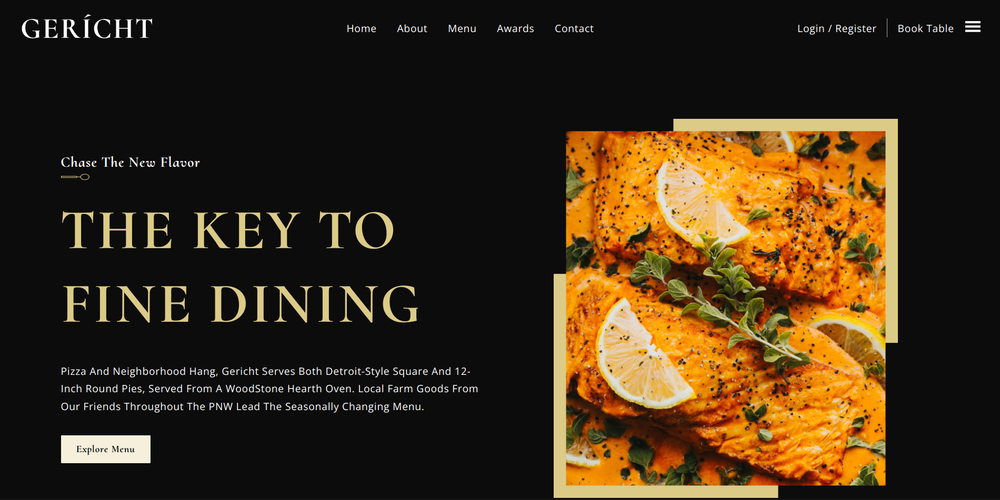

 # 
 Mock Restaurant Site 

 ### 
 A static React webpage 

 ### 
 [Live Demo](https://christofb7.github.io/gerich-restaurant/) 

 

### About:

Gericht is a mock fine dining website.

### It includes:
 - Data, images, and styles are built in a way for non-technial users to adjust information
 - Components like a sub heading, or menu items that get reused throughout
 - Using github pages and gh-pages dependency to host and deploy the react application to the github cloud
 - Using media queries to create a responsive design

 ### Built with:
 - React
 - Node js
 - Figma

 ### Key Concepts:
- React Basics
    - JSX
    - Props
    - State
    - Events
    - Conditional Rendering
- Figma Basics
    - Basics of UX Design
    - Animating content
    - Typography in design
    - Responsive Web Design

